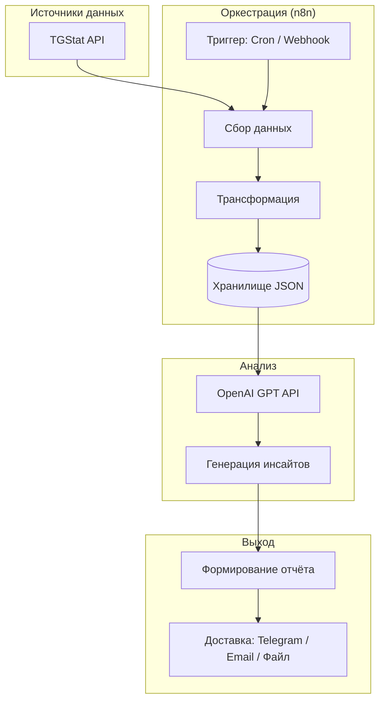

# Архитектура аналитической системы MOST

> Документ описывает техническую архитектуру системы аналитики для Telegram-канала MOST. Стек: TGStat API → n8n → GPT/OpenAI → отчёты.

---

## 1. Обзор системы

Система собирает статистику канала MOST через TGStat API, обрабатывает данные в n8n, анализирует их с помощью GPT и формирует еженедельные или on-demand отчёты.



**Схема потока данных:**
1. **Триггер** (cron по понедельникам или webhook по запросу) запускает workflow.
2. **Сбор** — n8n делает запросы к TGStat API.
3. **Трансформация** — данные приводятся к единому формату.
4. **Хранение** — JSON сохраняется (локально или в Supabase/облаке).
5. **Анализ** — GPT получает агрегированные данные и генерирует инсайты.
6. **Отчёт** — формируется текст/HTML и отправляется в Telegram или по email.

---

## 2. Компоненты

### 2.1. Слой сбора данных (Data Collection Layer)

**TGStat API Stat** — основной источник. Базовый URL: `https://api.tgstat.ru/`

| Эндпоинт | Метод | Назначение | Данные |
|----------|-------|------------|--------|
| `channels/get` | GET | Инфо о канале | Название, описание, подписчики, индекс цитирования |
| `channels/stat` | GET | Агрегированная статистика | participants_count, avg_post_reach, err_percent, daily_reach, ci_index, mentions_count, forwards_count |
| `channels/posts` | GET | Список постов | Посты с views, date, text, link (limit 50, offset) |
| `channels/subscribers` | GET | Динамика подписчиков | participants_count по дням/неделям (тариф S+) |
| `channels/avg-posts-reach` | GET | Динамика охвата | avg_posts_reach по дням/неделям (тариф S+) |
| `posts/stat` | GET | Статистика поста | viewsCount, sharesCount, reactionsCount, forwardsCount, mentionsCount, views (динамика) |

**Что собирать для MOST:**

| Данные | Эндпоинт | Периодичность |
|--------|----------|---------------|
| Текущие метрики канала | channels/stat | Еженедельно |
| Информация о канале | channels/get | При первом запуске / ежемесячно |
| Посты за период | channels/posts (startTime, endTime) | Еженедельно |
| Топ-5 постов по охвату | channels/posts + сортировка | Еженедельно |
| Динамика подписчиков | channels/subscribers (group=week) | Еженедельно (если тариф S+) |
| Детальная статистика топ-постов | posts/stat | Для 3–5 лучших постов |

**Идентификатор канала MOST:** `@MOST` или `t.me/MOST` (уточнить точный username).

---

### 2.2. Слой обработки (Processing Layer)

**n8n** — оркестрация всех шагов.

**Основные операции:**
- Параллельные HTTP-запросы к TGStat (где возможно).
- Обработка ошибок и retry при 429/5xx.
- Вычисление производных метрик: ERR, рост подписчиков, средний охват.
- Агрегация данных в единый JSON для GPT.

**Структура данных на выходе обработки:**
```json
{
  "period": "2026-02-17 — 2026-02-23",
  "channel": {
    "title": "MOST",
    "participants_count": 12500,
    "avg_post_reach": 3200,
    "err_percent": 25.5,
    "daily_reach": 45000
  },
  "subscribers_delta": 150,
  "posts_count": 12,
  "top_posts": [
    {
      "link": "t.me/MOST/123",
      "views": 5200,
      "date": "2026-02-20",
      "text_preview": "..."
    }
  ],
  "metrics_trend": "up|down|stable"
}
```

---

### 2.3. Слой анализа (Analysis Layer)

**OpenAI GPT API** — генерация инсайтов и выводов.

**Промпты (шаблоны):**

1. **Системный промпт:**
```
Ты — аналитик Telegram-каналов. Ты получаешь JSON со статистикой канала MOST за период. 
Твоя задача: выявить тренды, дать практические рекомендации, выделить лучший контент. 
Пиши кратко, по делу, на русском. Используй цифры из данных.
```

2. **Промпт для еженедельного отчёта:**
```
Проанализируй данные и сформируй еженедельный отчёт по структуре:
1. Ключевые метрики (3-5 предложений)
2. Динамика: что выросло/упало
3. Топ-3 поста недели и почему они сработали
4. Рекомендации на следующую неделю (2-3 пункта)
5. Риски или моменты внимания

Данные: {{ $json.aggregated_data }}
```

3. **Промпт для on-demand (глубокий анализ):**
```
Данные канала MOST за период {{ period }}. 
Сделай углублённый анализ: сравнение с предыдущим периодом, сегментация по типам контента, 
оптимальное время публикаций, прогноз на следующий период.
Данные: {{ $json.aggregated_data }}
```

---

### 2.4. Слой вывода (Output Layer)

**Формат отчёта:**
- Markdown или HTML.
- Возможность экспорта в PDF (через n8n или внешний сервис).

**Способы доставки:**
| Метод | Реализация в n8n |
|-------|------------------|
| Telegram | Узел "Send Message" → Bot API или Telegram Trigger |
| Email | Узел "Send Email" (SMTP) |
| Файл | Сохранение в Google Drive / Dropbox / локально |
| Webhook | Отправка JSON в другой сервис |

**Рекомендация:** основной канал — Telegram (в канал MOST или в личку редактору).

---

## 3. Поток данных (Data Flow)

```
[Cron: понедельник 09:00] или [Webhook: /report-now]
        │
        ▼
┌───────────────────────────────────────────────────────────────┐
│  n8n Workflow: MOST Analytics                                  │
├───────────────────────────────────────────────────────────────┤
│  1. Set Variables: channel_id=@MOST, period=last_7_days       │
│  2. HTTP Request: channels/get                                │
│  3. HTTP Request: channels/stat                               │
│  4. HTTP Request: channels/posts (startTime, endTime)          │
│  5. [Опционально] HTTP Request: channels/subscribers           │
│  6. Merge: объединить ответы в один объект                     │
│  7. Code/Function: вычислить top_posts, delta, тренды          │
│  8. HTTP Request: OpenAI Chat Completion (анализ)             │
│  9. Format: собрать финальный отчёт (шаблон + GPT output)      │
│ 10. Telegram/Email: отправить отчёт                            │
│ 11. [Опционально] Save to Supabase/Google Sheets               │
└───────────────────────────────────────────────────────────────┘
```

---

## 4. Структура n8n workflow

### Узлы и связи

```
[Schedule Trigger] ──┬── [Manual Trigger / Webhook]
                     │
                     ▼
              [Set: channel_id, period]
                     │
                     ▼
         ┌───────────┴───────────┐
         │                       │
         ▼                       ▼
[HTTP: channels/get]    [HTTP: channels/stat]
         │                       │
         └───────────┬───────────┘
                     │
                     ▼
         [HTTP: channels/posts]
         (startTime, endTime из period)
                     │
                     ▼
              [Merge Node]
         (объединить все ответы)
                     │
                     ▼
              [Code Node]
    (агрегация, top_posts, delta, тренды)
                     │
                     ▼
         [OpenAI: Chat Completion]
         (промпт + aggregated_data)
                     │
                     ▼
              [Template: отчёт]
         (заголовок + GPT response)
                     │
                     ▼
         [Telegram: Send Message]
         или [Email] или [Save File]
```

### Параметры узлов

**HTTP Request (TGStat):**
- URL: `https://api.tgstat.ru/channels/stat`
- Method: GET
- Query params: `token`, `channelId`
- Authentication: token в query (или header, если API поддерживает)

**OpenAI:**
- Model: `gpt-4o-mini` (экономия) или `gpt-4o` (качество)
- System message: системный промпт аналитика
- User message: промпт с `{{ $json.aggregated_data }}`

**Telegram:**
- Chat ID: ID канала или чата для отчётов
- Parse mode: Markdown
- Text: `{{ $json.report_text }}`

---

## 5. Расписание (Scheduling)

| Режим | Триггер | Когда |
|-------|---------|-------|
| Авто еженедельно | Cron | Понедельник, 09:00 (после выходных) |
| По запросу | Webhook | POST `/webhook/most-report` с опциональным `?period=7` |
| Ручной запуск | Manual | Кнопка "Execute Workflow" в n8n |

**Cron выражение для n8n:** `0 9 * * 1` (каждый понедельник в 09:00).

**Webhook:** создать Production Webhook в n8n, сохранить URL. Можно добавить простую проверку (секрет в query/header).

---

## 6. API-ключи и настройка

### Необходимые ключи

| Сервис | Где взять | Переменная в n8n |
|--------|-----------|-------------------|
| TGStat API | [tgstat.ru/my/profile](https://tgstat.ru/my/profile) → API → Токен | `TGSTAT_TOKEN` |
| OpenAI | [platform.openai.com](https://platform.openai.com/api-keys) | `OPENAI_API_KEY` |
| Telegram Bot | [@BotFather](https://t.me/BotFather) → /newbot | `TELEGRAM_BOT_TOKEN` |
| Telegram Chat ID | Переслать сообщение боту [@userinfobot](https://t.me/userinfobot) | `MOST_REPORT_CHAT_ID` |

### TGStat тарифы

- **FREE:** до 2 своих каналов, ограниченные запросы.
- **S и выше:** `channels/subscribers`, `channels/avg-posts-reach` — динамика по периодам.

Проверить квоту: [usage/stat](https://api.tgstat.ru/docs/ru/usage/stat.html).

### Шаги настройки

1. **n8n:** установить (Docker / self-hosted / n8n.cloud).
2. **Credentials:** создать в n8n:
   - Generic Credential Type: `TGSTAT_TOKEN`
   - OpenAI API: `OPENAI_API_KEY`
   - Telegram: `TELEGRAM_BOT_TOKEN`
3. **Переменные окружения:** задать `MOST_REPORT_CHAT_ID`, `MOST_CHANNEL_ID` (например `@MOST`).
4. **Импорт workflow:** создать workflow по схеме выше или импортировать JSON (если будет подготовлен).
5. **Тест:** Manual Trigger → проверить сбор, анализ и доставку.

---

## 7. Пример структуры отчёта

```markdown
# 📊 Еженедельный отчёт MOST | 17–23 февраля 2026

## Ключевые метрики
- **Подписчики:** 12 500 (+150 за неделю, +1.2%)
- **Средний охват поста:** 3 200 (ERR 25.5%)
- **Дневной охват:** ~45 000
- **Публикаций за неделю:** 12

## Динамика
- Рост подписчиков стабильный, тренд вверх
- Охват вырос на 8% к прошлой неделе
- Лучший день по вовлечённости: среда

## Топ-3 поста недели
1. **t.me/MOST/456** — 5 200 просмотров. Анонс акции: короткий текст + картинка
2. **t.me/MOST/451** — 4 800 просмотров. Обзор новинок: длинный пост с эмодзи
3. **t.me/MOST/448** — 4 100 просмотров. Мем/вирусный контент

## Рекомендации
- Публиковать анонсы в среду 10:00–12:00
- Увеличить долю визуального контента (посты с медиа дают +30% охвата)
- Повторить формат "обзор новинок" — высокий ER

## Внимание
- Один пост с охватом ниже среднего (возможно, неудачное время)
```

---

## 8. Дальнейшие шаги

1. [ ] Уточнить username канала MOST и наличие TGStat-доступа
2. [ ] Получить TGStat API токен и проверить тариф
3. [ ] Развернуть n8n (локально или cloud)
4. [ ] Создать workflow по архитектуре
5. [ ] Подключить OpenAI и Telegram
6. [ ] Прогнать тестовый отчёт
7. [ ] Настроить cron и webhook
8. [ ] (Опционально) Добавить API бота от Леры в слой сбора данных

---

*Документ создан: 2026-02-27. Обновлять при изменении архитектуры.*
